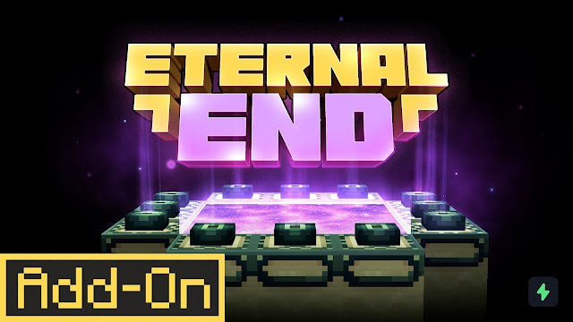
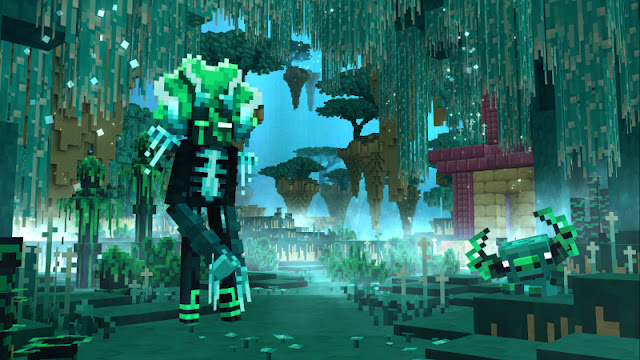
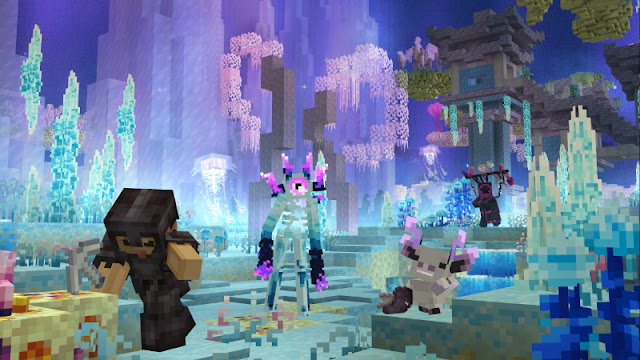
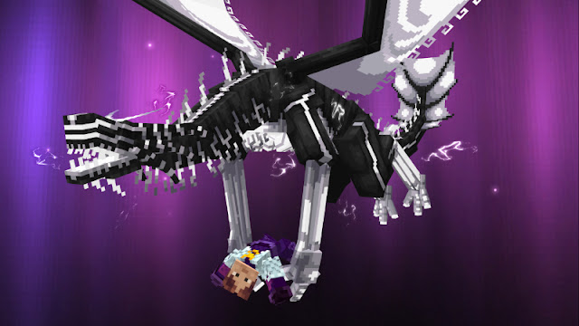

<h1>ETERNAL END</h1>

Explore a reimagined End Dimension like no other! Completely redesigned with endless new terrains and immersive biomes that go beyond anything you have seen before.
• 6 new Biomes
• Terrain & Structures
• 250+ Blocks & Items
• Armors & Tools
• Mobs, Villagers & Animals
• Boss Fight
• Realistic VFX & Soundscave

<h1>How It Work?</h1>

by adding

-205 block & Items

-new armor & tools

-New Mobs,villagers & animals

and boss fight

<h1>Who Created Eternal End?</h1>

Panascais

<h1>How many version are in Eternal End?</h1>

there are only 1 version

<ul>
<li>1.0</li>
</ul>
<h1>Does Eternal End Have Screenshot?</h1>

yes here is 5 screenshot

<h1>Where is the download?</h1>

here is the download

<a href="https://bedrock-hub.blogspot.com/2025/08/eternal-end.html?m=1" download>download</a>

Connect in whatsapp 896-8579-977 :3

If you wanna be friend in roblox then this the link :3

<a href="https://www.roblox.com/share?code=1db53eae1e69fe4780b57f19ae388f19&type=Profile&source=ProfileShare&stamp=1757743352086" download>Connect in roblox :3</a>
if you wanna subscribe us in youtube :3

<a href="https://youtube.com/@brutal_studio?feature=shared" download>subscribe on youtube:3</a>
If you wanna connect with us in telegram here the link:3

<a href="https://t.me/+jeNobnO7N2gzZGQ1"download>Join in telegram :3</a>
